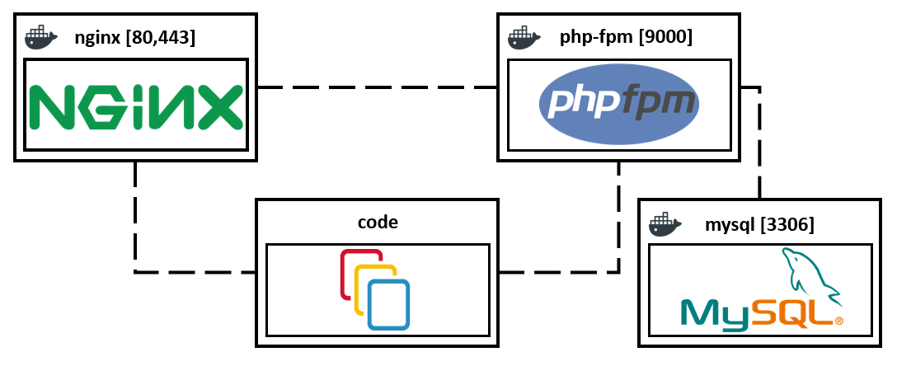

## Nginx + php8.1-fpm + laravel + mysql docker compose
An easy way to set up your Laravel application using Docker and docker compose.
This will set up a development environment with nginx, php8.4-fpm, and mysql.



### Quickstart for linux

Need install:
- docker 18.06.0+
- docker-compose 1.18.0+

##### How to fix docker: Got permission denied issue
1. Create the docker group if it does not exist
    - ```sudo groupadd docker```
2. Add your user to the docker group
    - ```sudo usermod -aG docker $USER```
3. Need to reboot your computer
    - ```sudo reboot```

If you WANT to use yourself host name, you MUST run:
- ```echo "127.0.0.1 project.local" >> /etc/hosts```

Create new .env file, copy content from .env.dist [.env for docker-compose]
- cd /YOUR_PROJECT_DIRECTORY/docker
- ```cp .env.dist .env```

Create new .env file, copy content from .env.dist [.env for symfony]
- cd /YOUR_PROJECT_DIRECTORY
- ```cp .env.example .env```

Open Git Bash in /YOUR_PROJECT_DIRECTORY/docker:
- ```sudo chmod +x run.sh ```
- ```./run.sh```

Next step:
* ```docker exec -it project_php composer install```
* ```docker exec -it project_php php artisan key:generate```
* ```docker exec -it project_php php artisan config:clear```
* ```docker exec -it project_php php artisan config:cache```
* ```docker exec -it project_php php artisan migrate```
* 
* ``` php artisan tinker```
* ```>>> \DB::table('migrations')->get();```

| Service      | Path                    |
| ------------ | ----------------------- |
| Website      | [http://localhost](http://localhost)| 

___
### Use docker commands
    docker images #List images
    docker ps #List containers
    docker exec -it project_php bash #Run a command in a running container
    docker stop $(docker ps -aq) #Stop one or more running containers
    docker history	#Show the history of an image
    docker logs	#Fetch the logs of a container
    
    Use this to delete everything: docker system prune -a --volumes

More info -> [The base command for the Docker CLI.](https://docs.docker.com/engine/reference/commandline/docker/)
